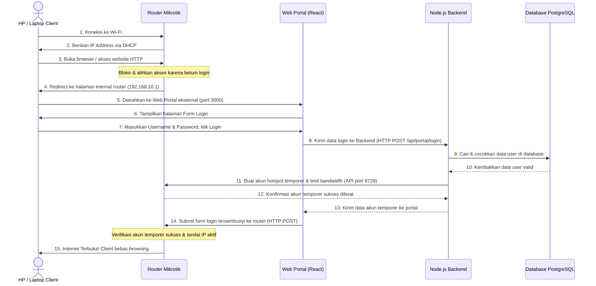
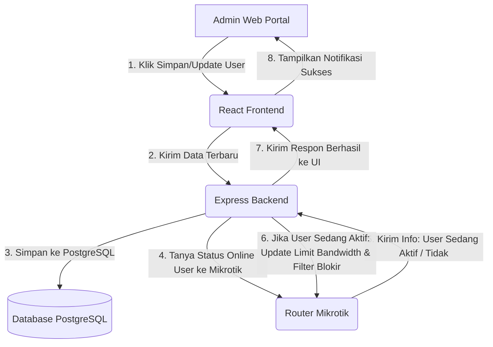
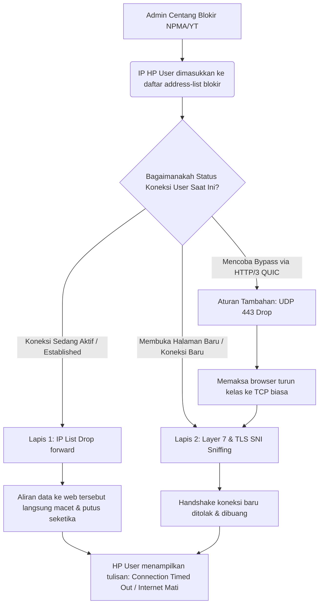
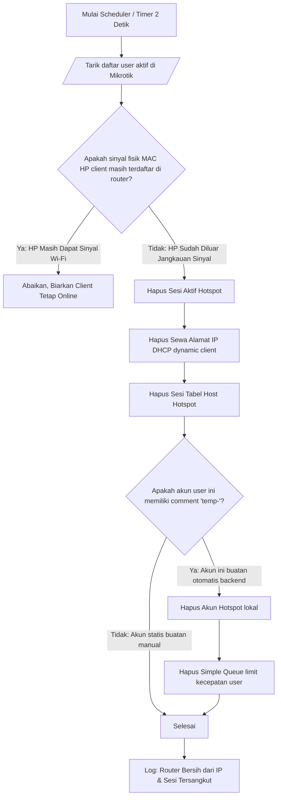

# Alur Logika Jaringan & Aplikasi (Logic Flow) 🔄🧠

Dokumen ini menjelaskan alur kerja (workflow) bagaimana sistem **WebHotspot Manager** mengontrol jaringan Mikrotik Anda. Penjelasan di bawah ini dirancang dengan bahasa yang **mudah dipahami orang awam** (menggunakan analogi sehari-hari) sekaligus tetap mempertahankan **akurasi teknis** untuk kebutuhan developer.

## 🌐 1. Alur Autentikasi Captive Portal (Proses Client Login Internet)

> **Analogi Sederhana**: Seperti pintu gerbang bioskop. Saat Anda baru masuk (koneka Wi-Fi), Anda dihentikan oleh petugas (Mikrotik) untuk membeli tiket di loket (halaman login portal). Setelah Anda beli tiket dan divalidasi, barulah Anda diperbolehkan masuk studio (internet).

Berikut diagram urutan langkah pertukaran data antara perangkat client, router, portal web, dan database:

### Penjelasan Rinci Langkah Demi Langkah (Untuk Orang Awam & Developer):

1. **Koneksi Jaringan Dasar (Langkah 1 & 2)**:
   * **Secara Teknis**: Perangkat client meminta sewa IP address (DHCP Request) ke router Mikrotik. Router membagikan IP dinamis (contoh: `192.168.10.254`) dan mencatat alamat hardware fisik (MAC Address: `9A:E6:77:1B:7C:0F`) pada tabel DHCP Leases.
   * **Bahasa Awam**: HP Anda menyapa Wi-Fi router, dan router memberikan "nomor rumah sementara" (IP Address) agar HP Anda bisa berkirim data di dalam jaringan tersebut.

2. **Pembajakan & Pengalihan Awal (Langkah 3, 4 & 5)**:
   * **Secara Teknis**: Ketika client mencoba membuka situs web non-HTTPS (port 80), aturan firewall NAT hotspot di Mikrotik membelokkan paket data tersebut dan merespon dengan header `HTTP 302 Redirect` ke halaman internal router (`http://192.168.10.1/login`). Di dalam memori router, berkas `redirect.html` langsung mengekstrak variabel dinamis Mikrotik (`$(ip)`, `$(mac)`, `$(link-login-only)`) dan mengalihkan browser client ke alamat Web Portal eksternal kita (`http://192.168.88.2:3000`) dengan menyertakan variabel tersebut sebagai parameter URL (Query String: `?ip=192.168.10.254&mac=9A:E6:77:1B:7C:0F&link-login-only=http://192.168.10.1/login`).
   * **Bahasa Awam**: Ketika Anda mencoba membuka Google, router menyadari Anda belum login. Router langsung memblokir jalan Anda dan otomatis memunculkan browser di HP Anda yang diarahkan langsung ke halaman loket web login kita, dengan membisikkan data IP dan MAC HP Anda ke halaman loket tersebut agar sistem tahu siapa Anda.

3. **Autentikasi Aplikasi (Langkah 6, 7, 8, 9 & 10)**:
   * **Secara Teknis**: Halaman React Web Portal membaca parameter URL dan menyimpannya di memori. Pengguna memasukkan username & password asli mereka. Portal mengirimkan data login beserta IP/MAC perangkat tersebut ke server Backend Express.js di port `3001` via HTTP POST (`/api/portal/login`) membawa JSON payload `{ username, password, ip, mac, linkLoginOnly }`. Backend kemudian melakukan kueri ke database PostgreSQL untuk memvalidasi apakah akun tersebut ada, aktif, dan tidak kedaluwarsa.
   * **Bahasa Awam**: Anda mengetik nama pengguna dan sandi Anda di halaman web loket. Halaman web tersebut mengirimkan nama Anda ke backend server untuk dicocokkan dengan buku catatan database. Jika nama Anda terdaftar dan berstatus aktif, server akan memberikan lampu hijau.

4. **Komunikasi API & Pembuatan Tiket Sementara (Langkah 11 & 12)**:
   * **Secara Teknis**: Begitu valid, backend menghasilkan password acak sekali pakai. Backend lalu melakukan koneksi API socket TCP (Port 8728) ke router Mikrotik menggunakan library `node-routeros`. Backend mengirim perintah `/ip/hotspot/user/add` untuk membuat user hotspot lokal temporer di router dengan comment `temp-<timestamp>` (agar nantinya bisa dihapus otomatis oleh scheduler router) dan parameter limit bandwidth sesuai dengan profil user tersebut di database.
   * **Bahasa Awam**: Setelah backend tahu Anda adalah user yang sah, backend langsung menelepon router Mikrotik melalui jalur khusus (API) dan berkata: *"Tolong buatkan tiket sementara bernama 'temp-xxx' khusus untuk HP ini, berikan kecepatan internet sesuai paketnya!"*. Mikrotik membuatkan tiket itu dan membalas *"Siap, tiket sudah dibuat!"*.

5. **Submit Akhir & Internet Terbuka (Langkah 13, 14 & 15)**:
   * **Secara Teknis**: Backend membalas request portal dengan status sukses beserta kredensial akun temporer. Browser client di halaman portal React menerima data sukses ini, lalu secara instan menjalankan kode Javascript untuk men-submit form HTTP POST tersembunyi (hidden form submit) secara langsung ke IP router Mikrotik (`http://192.168.10.1/login`) membawa data akun temporer. Router menerima data form login temporer tersebut, memverifikasinya cocok, dan menandai IP client tersebut di tabel `hotspot/active` sebagai authorized. Akses internet client langsung aktif.
   * **Bahasa Awam**: Web loket menerima tiket sementara dari backend. Browser HP Anda secara otomatis menyodorkan tiket sementara tersebut ke router Mikrotik di latar belakang (tanpa Anda sadari). Router melihat tiketnya cocok, langsung membuka palang pintu internet untuk HP Anda, dan Anda pun resmi terhubung ke internet!seketika.

---

## 👥 2. Alur Tambah & Edit User (Sinkronisasi Data Real-Time)

> **Analogi Sederhana**: Seperti memperbarui profil pelanggan di kasir. Begitu data pelanggan diubah di komputer kasir (web admin), server langsung mengirim pesan ke satpam di pintu masuk (router Mikrotik) untuk mengubah hak akses pelanggan tersebut secara instan.

### Penjelasan Rinci untuk Orang Awam:
1. **Ubah Data**: Admin mengubah bandwidth limit (misal dari 2Mbps naik ke 10Mbps) atau mencentang blokir situs di web admin.
2. **Pengecekan Status Aktif**: Aplikasi backend tidak hanya menyimpan data tersebut ke dalam database PostgreSQL, tetapi juga langsung bertanya ke Mikrotik: *"Apakah user ini sekarang sedang online menggunakan internet?"*
3. **Eksekusi Real-time**: 
   * Jika user **sedang online**, backend langsung memerintahkan Mikrotik detik itu juga untuk memperbarui limit kecepatannya (Simple Queue) dan memperbarui daftar blokirnya. Kecepatan internet user langsung berubah saat itu juga tanpa perlu diskonek.
   * Jika user **sedang offline**, data hanya disimpan di database. Aturan baru tersebut baru akan dipasang di Mikrotik nanti saat user tersebut login kembali.

---

## 🛡️ 3. Alur Pemblokiran Situs Lapis Ganda Real-Time (NPMA & YouTube)

> **Analogi Sederhana**: Seperti menutup keran air pipa spesifik yang sedang mengalir. Dibanding mematikan seluruh pompa utama rumah (mendiskonek internet user), sistem kita secara cerdas hanya menutup keran pipa khusus (IP Address List Drop) yang mengalirkan air ke bak tertentu (NPMA/YouTube) sehingga air ke bak tersebut langsung mampet.

### Penjelasan Rinci & Teknis (Kenapa Metode Ini Sangat Ampuh?):

Memblokir situs modern seperti YouTube sangat sulit karena mereka menggunakan **IP dinamis (banyak IP yang berubah-ubah)** dan **protokol HTTP/3 (QUIC)**. Jika hanya memakai satu metode, blokir akan mudah jebol. Sistem ini memadukan 3 lapis perlindungan:

#### 1. Lapis 1: Memutus Koneksi Aktif Berbasis IP Dinamis (`dst-address-list`)
* **Tantangannya**: YouTube memiliki ribuan IP address yang terus berubah setiap detiknya (CDN). Kita tidak mungkin menulis ribuan IP tersebut satu per satu secara manual.
* **Cara Kerja Teknis**: Mikrotik memiliki fitur *Dynamic DNS Resolving*. Saat kita menambahkan nama domain `youtube.com` ke `/ip firewall address-list` (`youtube-blocked`), router Mikrotik secara pintar bertindak seperti anjing pelacak yang terus-menerus memantau IP-IP baru milik YouTube di internet dan menyimpannya secara dinamis.
* **Eksekusi Real-time**: Ketika admin mengaktifkan blokir di web, IP HP user dimasukkan ke list `hotspot-blocked-youtube`. Aturan firewall drop langsung aktif. Karena firewall mendeteksi paket data berdasarkan IP tujuan (`youtube-blocked`), **koneksi yang sedang berjalan (established) akan langsung terpotong saat itu juga** tanpa menunggu browser di-refresh atau koneksi Wi-Fi diputus.

#### 2. Lapis 2: Menangkal Bypass DNS Berbasis Sensor Nama Situs (`Layer 7 & TLS SNI`)
* **Tantangannya**: Jika pengguna mengubah pengaturan DNS di HP mereka secara manual (misal memakai Secure DNS atau Google DNS `8.8.8.8`), IP YouTube yang diakses HP mereka tidak akan sempat terdeteksi oleh dynamic list router, sehingga blokir IP Lapis 1 bisa lolos.
* **Cara Kerja Teknis**: Di sinilah Lapis 2 bekerja. Ketika HP mencoba membuat sambungan baru ke website, browser wajib mengirimkan pesan jabat tangan pertama yang disebut **TLS Client Hello**. Pada pesan awal ini, nama website tujuan dikirim secara polos (tidak dienkripsi) di dalam parameter bernama **SNI (Server Name Indication)**.
* **Eksekusi Real-time**: Firewall Mikrotik menggunakan mesin pencari pola teks (`layer7-protocol`) untuk "menguping" pesan jabat tangan awal tersebut. Begitu terdeteksi teks bertuliskan `youtube`, `googlevideo`, atau `npma.my.id`, router akan langsung membuang paket tersebut sebelum koneksi internet sempat tersambung.

#### 3. Lapis Tambahan: Menutup Celah Bypass QUIC Protokol (UDP Port 443)
* **Tantangannya**: Browser modern seperti Google Chrome dan HP Android sering menggunakan teknologi **HTTP/3 (QUIC)** yang berjalan di atas protokol UDP port 443. Protokol ini tidak menggunakan jabat tangan TLS standar, sehingga bisa lolos dari sensor L7 biasa.
* **Cara Kerja Teknis**: Sistem memasang filter khusus yang memblokir semua lalu lintas UDP port 443 (`protocol=udp dst-port=443`) bagi perangkat user yang sedang diblokir.
* **Eksekusi Real-time**: Karena port UDP 443 diblokir, browser HP client akan otomatis menyerah dan melakukan *fallback* (turun kelas) menggunakan protokol TCP standar (port 443 TCP). Begitu browser turun kelas ke TCP, koneksi mereka otomatis masuk perangkap sensor Lapis 1 dan Lapis 2 kita, membuat pemblokiran menjadi 100% rapat tanpa celah!

---

## 🔌 4. Alur Pembersih Sesi Otomatis (Autocleanup Jaringan)

> **Analogi Sederhana**: Seperti sensor lampu otomatis di toilet mall. Jika sensor mendeteksi sudah tidak ada orang di dalam ruangan (perangkat client sudah keluar dari area jangkauan Wi-Fi router), sistem akan otomatis mematikan lampu dan menyiram toilet (menghapus sewa IP, host, dan queue) agar hemat energi dan tempat bersih kembali.

### Penjelasan Rinci untuk Orang Awam:
1. **Sinyal Wi-Fi Hilang**: Ketika pengguna pergi meninggalkan area jangkauan Wi-Fi (misalnya pulang ke rumah), HP mereka secara fisik terputus dari antena router.
2. **Pembersihan Cepat**: Scheduler pintar di dalam Mikrotik yang berjalan setiap **2 detik** akan menyadari hilangnya sinyal HP tersebut.
3. **Mencegah IP Tersangkut (Ghost Lease)**: Script langsung menghapus sewa IP (DHCP Lease) dan tabel host HP tersebut dari memori router. Ini mencegah bug klasik Mikrotik di mana IP client tersangkut sehingga orang lain tidak bisa masuk.
4. **Penghapusan Akun Sampah**: Jika akun tersebut berjenis sementara (memiliki tanda `temp-`), script juga akan menghapus akun login dan simple queue-nya agar Winbox Anda tetap bersih, rapi, dan kapasitas CPU router tidak terbebani oleh sampah rule yang menumpuk.
